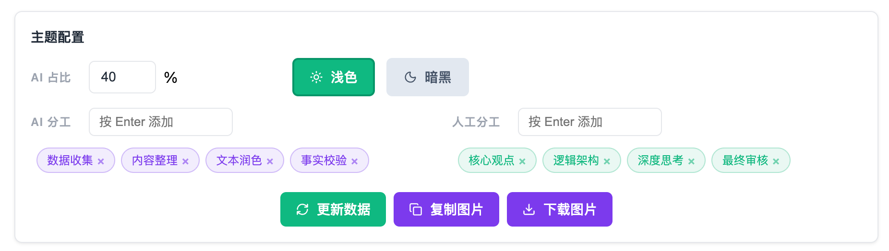

# AI Content Transparency

  <a href="./README.md">中文</a>
  ·
  <a href="./README.en.md">English</a>

A voluntary transparency and self-discipline initiative for AI participation in content creation, with a built-in badge generator

  <a href="https://wwenj.github.io/ai-content-transparency/generator/index.html">AI Disclosure Badge Generator</a>

## Overview

This project is designed for content creation scenarios and aims to provide a simple, explicit, and practical way to disclose AI usage transparently. It also includes an online declaration card generator for quickly producing a badge image suitable for the beginning of an article.

## Why This Project

As AI capabilities spread rapidly, their impact on content creation has become unprecedented. It is now increasingly difficult to create content without AI tools, yet most published works still do not clearly explain whether AI was involved, how much it contributed, or what role it played. This leads to several issues:

- readers cannot accurately judge how the content was produced
- creators lack a consistent and clear disclosure format
- the boundary between fully human-created content and heavily AI-assisted content becomes blurred
- large-scale AI-generated publishing leads to an overflow of low-quality content and seriously harms the reading experience

The position of this project is straightforward: **AI is not prohibited, but transparency comes first**.

## Core Principles

### 1. Transparency First

If AI has materially contributed to the final content, that involvement should be disclosed in a clear, visible, and understandable way.

### 2. AI Usage Is Not Opposed

This project does not treat AI as a tool that should be rejected. What it opposes is hidden usage, vague wording, or deliberate audience misdirection.

### 3. Human Responsibility Remains

Whether AI is used or not, the final publisher remains responsible for factual accuracy, judgment, content framing, and the result of publication.

### 4. Disclosure Should Be Specific

The project recommends explicitly stating:

- AI ratio
- AI roles

### 5. Voluntary Adoption

This is an open-source initiative, not a legal rule, not a platform requirement, and not a certification system. Its value comes from creator self-discipline and community consensus.

### Display Recommendation

The declaration should be placed at the beginning of the article, page, or post.

## Quick Start

### Online AI Declaration Generator

- Open directly and export: [https://wwenj.github.io/ai-content-transparency/generator/index.html](https://wwenj.github.io/ai-content-transparency/generator/index.html)

### Steps

1. Enter the AI ratio and AI roles
2. Generate the card and export the image
3. Place the declaration card or text notice at the beginning of the content

### Preview Examples (Light and Dark Themes)

**Settings Panel**

**Light Example**

**Dark Example**

## Use Cases

- blog posts
- paid knowledge content
- technical documentation
- curated information articles
- research notes
- long-form creator content

## Open Source

- License: [MIT](./LICENSE)
- Generator: [generator/index.html](./generator/index.html)
