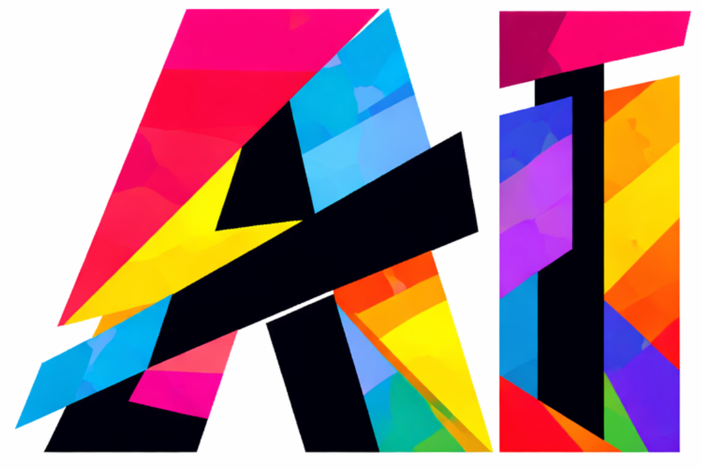

# AI Content Transparency

  <a href="./README.md">中文</a>
  ·
  <a href="./README.en.md">English</a>

 面向 AI 参与内容创作的自律与透明化声明倡议，附带标识生成工具

  <a href="https://wwenj.github.io/ai-content-transparency/generator/index.html">声明标识快速生成器</a>

## 项目简介

当前项目面向内容创作场景，旨在提供一套简洁、明确、可落地的 AI 使用透明声明化方案。项目同时提供一个可直接在线访问的声明卡片生成器，用于快速生成适合文章开头展示的说明图片。

## 为什么需要这个项目

随着 AI 能力的快速普及，对内容创作的冲击是史无前例的，当下的内容创作已很难脱离 AI 工具，但大多数作品并没有明确说明 AI 是否参与、参与了多少、具体承担了什么角色。这会导致：

- 读者无法准确判断内容的生产方式
- 创作者之间缺少统一、清晰的声明口径
- “完全人工”与“高度 AI 参与”的边界被模糊化
- 利用 AI 生成大量的内容，导致低质量内容泛滥，严重影响用户阅读体验

本项目的立场很明确：**不禁止 AI，但强调透明优先**。

## 核心原则

### 1. 透明优先

当 AI 对最终内容形成实质性参与时，应以清晰、可见、易理解的方式进行说明。

### 2. 不反对使用 AI

本项目不将 AI 视为应被排斥的工具。我们反对的是隐瞒使用、模糊表述、或故意误导受众。

### 3. 人类责任保留

无论是否使用 AI，最终发布者仍应对事实准确性、价值判断、内容表达和发布结果负责。

### 4. 声明应尽量具体

推荐明确说明：

- AI 占比
- AI 分工

### 5. 自愿采用

本项目是开源倡议，不是法律规则、不是平台强制要求，也不是认证体系。其价值来自创作者的自律与社区共识。

### 展示要求

声明建议放在文章、页面或帖文开头

## 快速使用

### 文章头部 AI 声明在线生成器

- 直接访问使用并下载：[https://wwenj.github.io/ai-content-transparency/generator/index.html](https://wwenj.github.io/ai-content-transparency/generator/index.html)

### 使用步骤

1. 输入 AI 占比与 AI 分工
2. 生成卡片并导出图片
3. 将声明卡片或文本声明放在内容开头

### 示例预览（浅色、暗黑主体）

**设置界面**

**浅色示例**

**暗黑示例**

## 适用场景

- 博客文章
- 知识付费内容
- 技术文档
- 资讯整理
- 研究笔记
- 自媒体长文

## 开源说明

- License: [MIT](./LICENSE)
- Generator: [generator/index.html](./generator/index.html)
